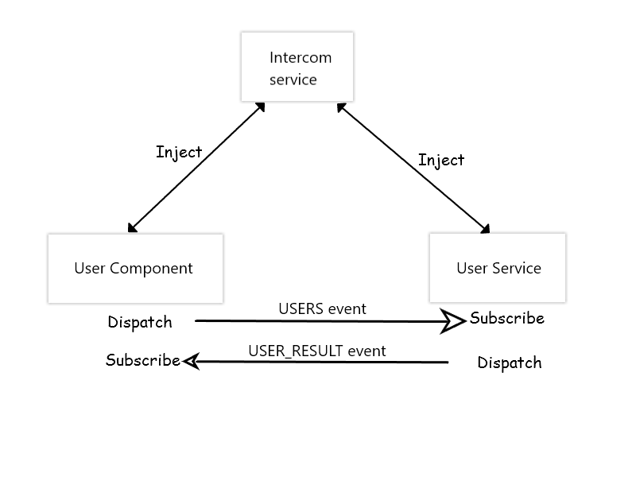

## Intercom :phone: for angular components, services and anything in general

As the word suggests, intercom aids communication between components, services and anything you can think of with in a project. It is based on publish/subscribe or observer pattern.

I will cover simple use case to demonstrate the use of intercom service. I will query a list of github users and display it using this service.

Following figure explains how the intercom service works


(Excuse me for the above artwork :joy:)

We use event literals (`event-literals.ts`) to define events that we can subscribe/dispatch to communicate between different entities (in our case component and service)

The flow is really simple. The `UsersComponent` template has a button. On click of this button, we want to get github users and render their information. To accomplish this, let us begin with `UsersComponent`

1.  Handle user action in `UsersComponent`

    Here, what we want is, when the `Get Github Users` button is clicked, the `UsersService` should be notified to fetch the users. So to get this done, we get the instance of `IntercomService` by specifying the same in class constructor
    
    ```
    constructor(private intercom:IntercomService) {
    }
    ```
    Now, handle the button click in `users.component.html` by attaching the following listener, in the component, to the click event
    
    ```
    onGetUsers() {
      let event = {
        type: USERS
      }

      this.intercom.dispatch(event);
    }
    ```
    Here we are using the `IntercomService` to let `UsersService` know that we are in need of github users. So to notify, `USERS` event (which is declared in `event-literals.ts`) is used. The service will not be notified because it has not subscribed to the event yet. So let us do that now.
    
2.  Subscribe to `USERS` event in `UsersService`

    In this service as well, we will get the instance of `IntercomService` as follows
    
    ```
    constructor(private intercom:IntercomService) {
    }
    ```
    Now, in order to get notification for `USERS` event that is dispatched in step 1, let us subscribe to the event in constructor as 
    
    ```
    constructor(private intercom:IntercomService, private http:Http) {
      intercom.subscribe(USERS, this.onGetUsers.bind(this));
    }
    ```
    Here we specify that when `USERS` event is dispatched, execute the `onGetUsers` function to get the users. Here is the implementation of `onGetUsers` function
    
    ```
    onGetUsers(event) {
      let randomOffset = Math.floor(Math.random()*500);
      this.http.get(USERS_URL + `?since=${randomOffset}`)
          .map(response => response.json())
          .subscribe(result => {
            
          });
    }
    ```
    We are using the [Github public api](https://api.github.com/users) to get list of users. Once we have the users, we need to let `UsersComponent` know that user data is available. So lets do that now
    
3.  Dispatch `USER_RESULT` event from `UsersService`
    
    Once we have data, we use the `USER_RESULT` event (declared in `event-literals.ts`) to notify `UsersComponent` of the same. When dispatching this event, we also pass the user data as payload.
    
    ```
    onGetUsers(event) {
      let randomOffset = Math.floor(Math.random()*500);
      this.http.get(USERS_URL + `?since=${randomOffset}`)
          .map(response => response.json())
          .subscribe(result => {
            let evt = {
              type: USER_RESULT,
              payload: result
            };

            this.intercom.dispatch(evt);
          });
    }
    ```
    For `UsersComponent` to be able to get data, lets modify it a bit in next step
    
4.  Receive data in `UsersComponent`

    In order to receive data in `UsersComponent`, we need to subscribe to the `USER_RESULT` event. We do that in component's constructor as
    ```
    constructor(private intercom:IntercomService) {
      this.intercom.subscribe(USER_RESULT, this.onUserResult.bind(this));
    }
    ```
    In `onUserResult()`, the argument that we receive will be nothing but the event that was dispatched in step 3 along with the user data. The `onUserResult()` is implemented as
    ```
    onUserResult(event) {
      this.users = event.payload;
    }
    ```
    There is one last thing we need to take care of. Since in step 2, we have subscribed to `USERS` event in constructor of `UsersService`, we need to instantiate this class. If we do not do this, obviously nothing will happen if you click the button `Get Github Users`. So we get an instance of service class injected in `app.component.ts` as
    ```
    constructor(private userService: UsersService) {}
    ```

Voilà! We completed our flow of getting the users on click of a button and rendering the data as soon as it is available, all using `IntercomService`. This is just one use case that is covered. As the project grows, there will be many components and there will be definitely a need for communication between them. So all you need to do is, get the service injected in those components, and set up a communication channel by subscribing and dispatching events.

Hope it helps someone

## License

MIT